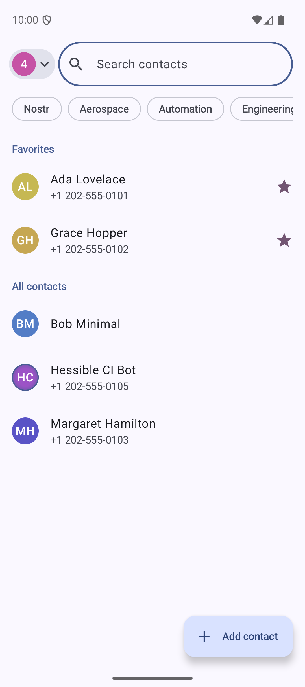
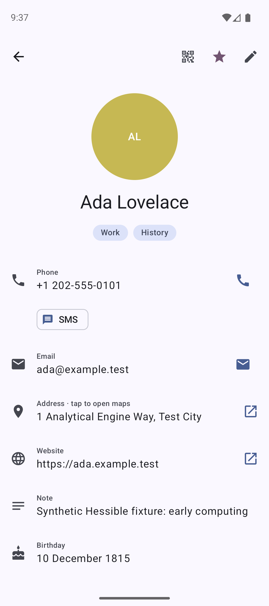
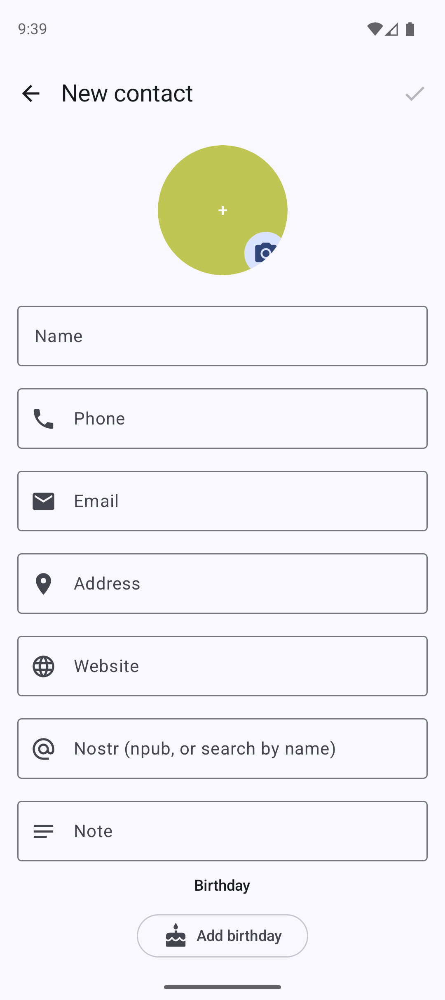
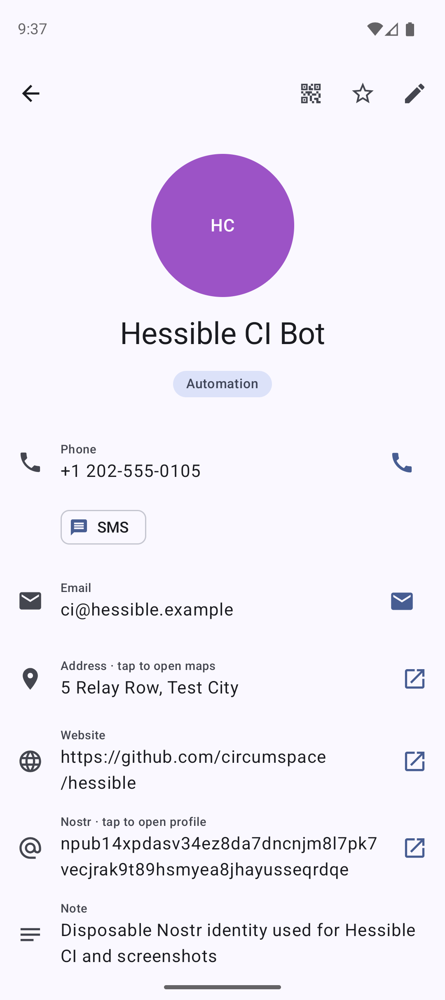
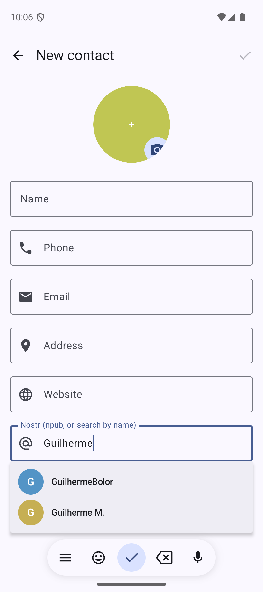

# Hessible

A privacy-first Android contacts app. Your contacts are encrypted end-to-end and stored on
Nostr relays — readable only with your key, syncable across devices, with no central server.

> Early work in progress.

## Screenshots

| Contacts | Contact details | Add a contact |
| :---: | :---: | :---: |
|  |  |  |

| Nostr-aware contacts | Nostr profile search |
| :---: | :---: |
|  |  |

## What it does

- **Encrypted everywhere** — each contact is a NIP-44-encrypted `kind:30078` event, replicated to
  every relay you enable. Encrypted at rest on-device too (Android Keystore).
- **System integration** — contacts sync into Android's contacts provider, so they show up in the
  Phone, Messaging, and Mail apps.
- **Relay management** — add/remove relays, mark them paid/self-hosted, and detect a local relay
  (e.g. Citrine) for durable on-device backup.
- **Nostr-aware** — search profiles by name, show avatars, verify NIP-05, highlight linked
  contacts, pin favorites.
- **vCard import/export** and sign-in with a local key (nsec) or an external signer (Amber/NIP-55).

## Build

Requires Android Studio with a recent AGP/Kotlin toolchain.

```sh
./gradlew assembleDebug
```

## CI and releases

GitHub Actions runs lint, unit tests, and debug/release builds for pushes and pull requests. A
SemVer tag matching `v*` creates a native GitHub release from a commit already merged into `main`,
using the curated notes in `RELEASE_NOTES.md`. Release tags require these repository secrets:

- `HESSIBLE_KEYSTORE_BASE64`
- `HESSIBLE_KEYSTORE_PASSWORD`
- `HESSIBLE_KEY_ALIAS`
- `HESSIBLE_KEY_PASSWORD`

The release job verifies the APK package, version, and signing certificate before publishing it.
Release signing certificate SHA-256:
`EC:82:BE:84:EA:62:1F:01:4B:9E:DE:7E:E5:B6:AF:D2:3B:03:95:EF:1C:FA:80:FE:3F:BE:39:CA:88:B8:75:E2`.

## License

Apache License 2.0 — see [LICENSE](LICENSE). Copyright © hermeticvm.
